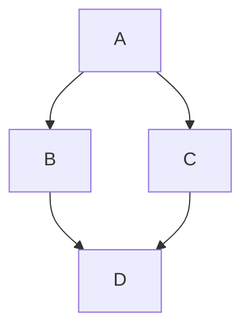
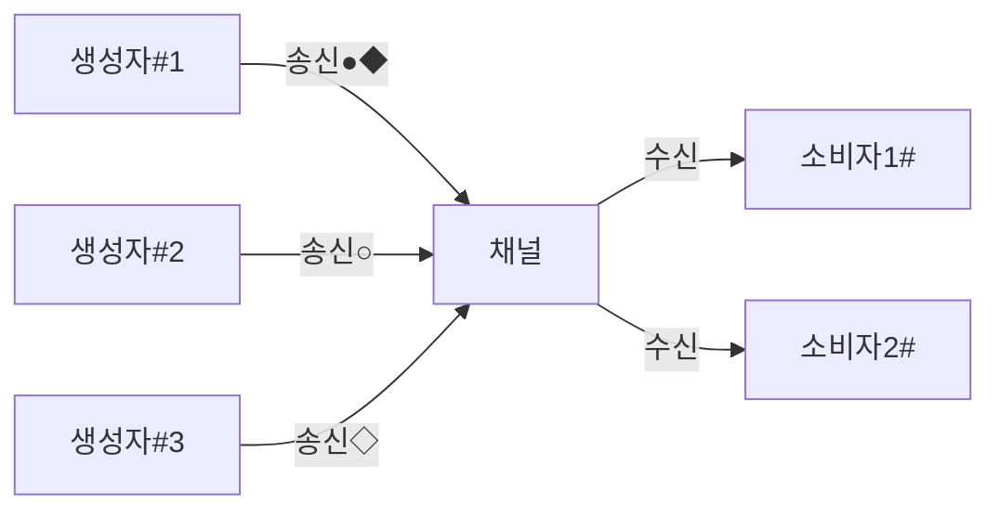

## Flutter aaaaaaaaaa

`-` 게시물 업로드 양식

## 위 형식을 참고하여 블로그를 커스텀하시오

게시물 업로드 양식

```mermaid
  graph TD;
      A-->B;
      A-->C;
      B-->D;
      C-->D;
```

```mermaid
 flowchart LR
;
    코루틴#1 -- 송신 --> 채널;
    채널 -- 수신 --> 코루틴#2
```

```mermaid
 flowchart LR
;
    생성자#1 -- 송신●◆ --> 채널;
    생성자#2 -- 송신○ --> 채널;
    생성자#3 -- 송신◇ --> 채널;
    채널 -- 수신 --> 소비자1#
    채널 -- 수신 --> 소비자2#
```
[출처] github markdown에 chart (diagram) 작성방법|작성자 ms
