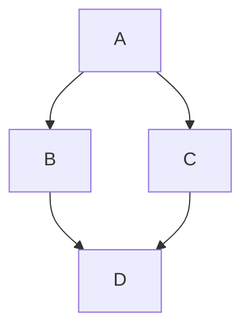

[Picture 1]


[Picture 2]


[Picture 3]


플러터에서 `Column`과 `Row` 위젯은 레이아웃을 구성하는 데 매우 중요한 역할을 합니다. 이 두 위젯은 자식 위젯들을 수직 또는 수평으로 배치할 수 있게 해줍니다. 각각의 특성과 사용 방법에 대해 자세히 설명하겠습니다.

### Column 위젯

`Column` 위젯은 자식 위젯들을 수직으로 정렬합니다. 자식 위젯들은 위에서 아래로 배치되며, 주로 세로 방향의 레이아웃을 만들 때 사용됩니다.

#### 주요 속성
- **children**: Column에 포함될 자식 위젯들의 리스트입니다.
- **mainAxisAlignment**: 자식 위젯들이 주 축(main axis)에서 어떻게 정렬될지를 결정합니다. 예를 들어, `MainAxisAlignment.start`, `MainAxisAlignment.center`, `MainAxisAlignment.end`, `MainAxisAlignment.spaceBetween`, `MainAxisAlignment.spaceAround`, `MainAxisAlignment.spaceEvenly` 등이 있습니다.
- **crossAxisAlignment**: 교차 축(cross axis)에서 자식 위젯들의 정렬을 설정합니다. `CrossAxisAlignment.start`, `CrossAxisAlignment.center`, `CrossAxisAlignment.end`, `CrossAxisAlignment.stretch` 등을 사용할 수 있습니다.
- **mainAxisSize**: Column의 주 축 크기를 결정합니다. `MainAxisSize.max` (기본값)와 `MainAxisSize.min`이 있습니다.

#### 예제
```dart
Column(
  mainAxisAlignment: MainAxisAlignment.center,
  crossAxisAlignment: CrossAxisAlignment.start,
  children: <Widget>[
    Text('첫 번째 텍스트'),
    Text('두 번째 텍스트'),
    ElevatedButton(onPressed: () {}, child: Text('버튼')),
  ],
)
```

### Row 위젯

`Row` 위젯은 자식 위젯들을 수평으로 정렬합니다. 자식 위젯들은 왼쪽에서 오른쪽으로 배치되며, 주로 가로 방향의 레이아웃을 만들 때 사용됩니다.

#### 주요 속성
- **children**: Row에 포함될 자식 위젯들의 리스트입니다.
- **mainAxisAlignment**: 자식 위젯들이 주 축에서 어떻게 정렬될지를 결정합니다. `MainAxisAlignment.start`, `MainAxisAlignment.center`, `MainAxisAlignment.end`, `MainAxisAlignment.spaceBetween`, `MainAxisAlignment.spaceAround`, `MainAxisAlignment.spaceEvenly`를 사용할 수 있습니다.
- **crossAxisAlignment**: 교차 축에서 자식 위젯들의 정렬을 설정합니다. `CrossAxisAlignment.start`, `CrossAxisAlignment.center`, `CrossAxisAlignment.end`, `CrossAxisAlignment.stretch` 등을 사용할 수 있습니다.
- **mainAxisSize**: Row의 주 축 크기를 결정합니다. `MainAxisSize.max` (기본값)과 `MainAxisSize.min`이 있습니다.

#### 예제
```dart
Row(
  mainAxisAlignment: MainAxisAlignment.spaceEvenly,
  crossAxisAlignment: CrossAxisAlignment.center,
  children: <Widget>[
    Icon(Icons.home),
    Icon(Icons.favorite),
    Icon(Icons.settings),
  ],
)
```

### Column과 Row의 조합

`Column`과 `Row` 위젯은 함께 사용하여 복잡한 레이아웃을 구성할 수 있습니다. 
예를 들어, `Column` 안에 `Row`를 넣어 세로 방향으로 정렬된 아이템 사이에 가로 방향의 아이콘을 추가하는 방식입니다.

#### 예제
```dart
Column(
  children: <Widget>[
    Row(
      mainAxisAlignment: MainAxisAlignment.spaceBetween,
      children: <Widget>[
        Icon(Icons.home),
        Icon(Icons.favorite),
      ],
    ),
    Text('세로 텍스트'),
    ElevatedButton(onPressed: () {}, child: Text('버튼')),
  ],
)
```


### --------------


```dart
여러 위젯을 세로 및 가로로 배치
#
가장 일반적인 레이아웃 패턴 중 하나는 위젯을 세로 또는 가로로 배열하는 것입니다. 당신은 a를 사용할 수 있습니다. Row 위젯을 가로로 배열하는 위젯 및 a Column 위젯을 세로로 정렬합니다.

무슨 의미가 있습니까?
Row 그리고. Column 는 가장 일반적으로 사용되는 레이아웃 패턴 중 두 가지입니다.
Row 그리고. Column 각각 어린이 위젯 목록을 가져갑니다.
자식 위젯 자체가 a가 될 수 있습니다. Row, Column, 또는 다른 복잡한 위젯.
방법을 지정할 수 있습니다. Row 또는 Column 아이들을 세로와 가로로 정렬합니다.
특정 하위 위젯을 늘리거나 제한할 수 있습니다.
하위 위젯의 사용 방법을 지정할 수 있습니다. Rowsor Column사용 가능한 공간.
플러터에서 행 또는 열을 만들려면 하위 위젯 목록을 또는 위젯에 추가합니다. 각각의 아이는 그 자체로 행이 될 수도 있고 열이 될 수도 있습니다. 다음 예제에서는 행 또는 열 내부에 행 또는 열을 중첩할 수 있는 방법을 보여 줍니다.

이 레이아웃은 다음과 같이 구성됩니다. Row. 행에는 두 개의 자식이 있습니다. 왼쪽에는 열이 있고 오른쪽에는 이미지가 있습니다.

Screenshot with callouts showing the row containing two children

왼쪽 열의 위젯 트리가 행과 열을 중첩합니다.

Diagram showing a left column broken down to its sub-rows and sub-columns

네스팅 행과 열에 파블로바의 레이아웃 코드 일부를 구현합니다.

메모
Row 그리고. Column 수평 및 수직 레이아웃을 위한 기본 프리미티브 위젯입니다. 이러한 하위 수준 위젯을 사용하면 최대 사용자 지정이 가능합니다. Flutter는 또한 사용자의 요구에 충분할 수 있는 전문적이고 높은 수준의 위젯을 제공합니다. 예를 들어, 대신에 Row 선행 아이콘과 후행 아이콘에 대한 속성과 최대 3줄의 텍스트가 포함된 사용하기 쉬운 위젯을 선호할 수 있습니다. 열 대신 사용 가능한 공간에 맞게 내용이 너무 길면 자동으로 스크롤되는 열과 같은 레이아웃을 선호할 수 있습니다. 자세한 내용은 공통 레이아웃 위젯을 참조하십시오.

위젯 정렬하기
#
행 또는 열을 사용하여 자식 정렬 방법을 제어합니다. mainAxisAlignment 그리고. crossAxisAlignment 특성. 행의 경우 주축은 수평으로 실행되고 교차축은 수직으로 실행됩니다. 열의 경우 주축은 수직으로 실행되고 교차축은 수평으로 실행됩니다.

Diagram showing the main axis and cross axis for a row Diagram showing the main axis and cross axis for a column
및 enum은 정렬을 제어하기 위한 다양한 상수를 제공합니다.

메모
프로젝트에 이미지를 추가할 때 다음을 업데이트해야 합니다. pubspec.yaml 파일을 사용하여 액세스할 수 있습니다. 이 예에서는 Image.asset 이미지를 표시합니다. 자세한 내용은 이 예제의 파일 또는 자산 및 이미지 추가를 참조하십시오. 다음을 사용하여 온라인 이미지를 참조하는 경우 이 작업을 수행할 필요가 없습니다. Image.network.

다음 예에서는 3개의 이미지 각각의 너비가 100픽셀입니다. 렌더 박스(이 경우 전체 화면)는 너비가 300픽셀 이상이므로 주축 정렬을 다음과 같이 설정합니다. spaceEvenly 자유 수평 공간을 각 이미지 사이, 이전 및 이후로 고르게 나눕니다.

Row(
  mainAxisAlignment: MainAxisAlignment.spaceEvenly,
  children: [
    Image.asset('images/pic1.jpg'),
    Image.asset('images/pic2.jpg'),
    Image.asset('images/pic3.jpg'),
  ],
);
content_copy
Row with 3 evenly spaced images
앱 소스: 행_열

열은 행과 동일하게 작동합니다. 다음 예제에서는 각 이미지의 높이가 100픽셀인 3개의 이미지 열을 보여 줍니다. 렌더 박스(이 경우 전체 화면)의 높이는 300픽셀 이상이므로 주축 정렬을 다음과 같이 설정합니다. spaceEvenly 자유 수직 공간을 각 이미지 사이, 위, 아래로 고르게 나눕니다.

Column(
  mainAxisAlignment: MainAxisAlignment.spaceEvenly,
  children: [
    Image.asset('images/pic1.jpg'),
    Image.asset('images/pic2.jpg'),
    Image.asset('images/pic3.jpg'),
  ],
);
content_copy
앱 소스: 행_열


```


### 결론

`Column`과 `Row` 위젯은 Flutter에서 레이아웃을 구성하는 데 필수적입니다. 
각각의 위젯은 다양한 속성을 통해 자식 위젯들의 정렬과 배치를 유연하게 조정할 수 있으며, 
이를 통해 사용자 인터페이스를 직관적으로 설계할 수 있습니다.




